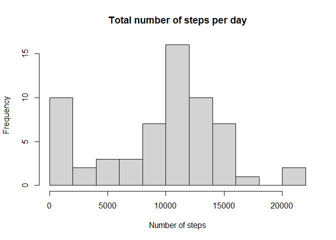
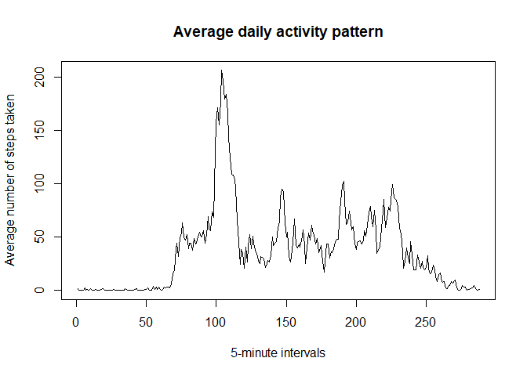
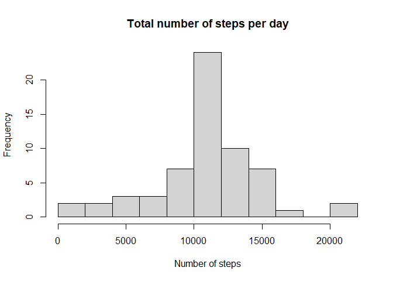
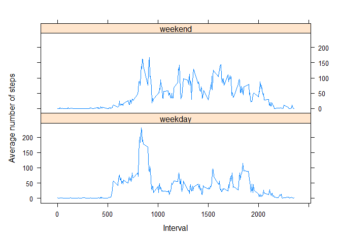

This is my RMarkdown document for the Course Project 1 of the Course Reproducible Research. In order to make all code chunks viewable, we will use the Global Options.


```r
knitr::opts_chunk$set(echo = TRUE)
rm(list = ls())
```


First of all, let's unzip the files and read data using the `unzip` and `csvread` functions.

## Loading and preprocessing the data

```r
unzip("activity.zip")
df <- read.csv("activity.csv")
```
Now, we can take a look at the type of data we have on each variable.


```r
str(df)
```

```
## 'data.frame':	17568 obs. of  3 variables:
##  $ steps   : int  NA NA NA NA NA NA NA NA NA NA ...
##  $ date    : chr  "2012-10-01" "2012-10-01" "2012-10-01" "2012-10-01" ...
##  $ interval: int  0 5 10 15 20 25 30 35 40 45 ...
```

```r
head(df,10)
```

```
##    steps       date interval
## 1     NA 2012-10-01        0
## 2     NA 2012-10-01        5
## 3     NA 2012-10-01       10
## 4     NA 2012-10-01       15
## 5     NA 2012-10-01       20
## 6     NA 2012-10-01       25
## 7     NA 2012-10-01       30
## 8     NA 2012-10-01       35
## 9     NA 2012-10-01       40
## 10    NA 2012-10-01       45
```

```r
dim(df)
```

```
## [1] 17568     3
```

Now, we transform data to make the analysis based on daily results.

First, this can be done using the `split` and `sapply` functions or using the `dplyr` package, which I will use.


Using the `group_by()` function we can split the data and make a summary with respect to `date` column as is shown in the next chunk.


```r
library(dplyr)
```

```
## 
## Attaching package: 'dplyr'
```

```
## The following objects are masked from 'package:stats':
## 
##     filter, lag
```

```
## The following objects are masked from 'package:base':
## 
##     intersect, setdiff, setequal, union
```

```r
DS <- group_by(df,date)
DS_sum <- summarize(DS, DailySteps = sum(steps, na.rm = TRUE), DailyMean  = mean(steps, na.rm = TRUE),DailyMedian = median(steps, na.rm = TRUE))
head(DS_sum)
```

```
## # A tibble: 6 × 4
##   date       DailySteps DailyMean DailyMedian
##   <chr>           <int>     <dbl>       <dbl>
## 1 2012-10-01          0   NaN              NA
## 2 2012-10-02        126     0.438           0
## 3 2012-10-03      11352    39.4             0
## 4 2012-10-04      12116    42.1             0
## 5 2012-10-05      13294    46.2             0
## 6 2012-10-06      15420    53.5             0
```


## What is mean total number of steps taken per day?

For this part, we will ignore the missing values in the dataset. 

In order to calculate the total number of steps taken per day we can use the function `mean` with two arguments in order to consider only not NA entries. This can be done with the `na.rm = TRUE` option.

We can:

1. Calculate the total number of steps taken per day. This will be reported in a column called *DailySteps*.
2. Make a histogram of the total number of steps taken each day. This will be the plot showed after the following chunk code.
3. Calculate an report the mean and median of the total number of steps taken per day. These values are reported in the *DailyMean* and *DailyMedian* columns.


```r
hist(DS_sum$DailySteps, main = "Total number of steps per day", breaks = 10, xlab = "Number of steps")
```

<!-- -->


Here we can see the total steps, as well as the mean and median number of steps per day. Please note that there are several days that contains only `NA`s entries, and therefore nor the median nor the mean can be computed.


```r
DS_sum
```

```
## # A tibble: 61 × 4
##    date       DailySteps DailyMean DailyMedian
##    <chr>           <int>     <dbl>       <dbl>
##  1 2012-10-01          0   NaN              NA
##  2 2012-10-02        126     0.438           0
##  3 2012-10-03      11352    39.4             0
##  4 2012-10-04      12116    42.1             0
##  5 2012-10-05      13294    46.2             0
##  6 2012-10-06      15420    53.5             0
##  7 2012-10-07      11015    38.2             0
##  8 2012-10-08          0   NaN              NA
##  9 2012-10-09      12811    44.5             0
## 10 2012-10-10       9900    34.4             0
## # ℹ 51 more rows
```

## What is the average daily activity pattern?

In this part, we will

1. Make a time series plot of the 5-minute interval (x-axis) and the average number of steps taken, averaged across all days (y-axis).
2. Determine which 5-minute interval, on average across all days in the dataset, contains the maximum number of steps?


First, we group the dataframe by the `interval` column, and calculate the mean for each interval. After that, the time series plot using the `plot()` function is showed.


```r
Intervals <- group_by(df, interval)
Intervals_sum <- summarize(Intervals, IntervalsAvgSteps = mean(steps, na.rm = TRUE))
Intervals_sum
```

```
## # A tibble: 288 × 2
##    interval IntervalsAvgSteps
##       <int>             <dbl>
##  1        0            1.72  
##  2        5            0.340 
##  3       10            0.132 
##  4       15            0.151 
##  5       20            0.0755
##  6       25            2.09  
##  7       30            0.528 
##  8       35            0.868 
##  9       40            0     
## 10       45            1.47  
## # ℹ 278 more rows
```

```r
plot(Intervals_sum$IntervalsAvgSteps,type = "l", xlab = "5-minute intervals", ylab = "Average number of steps taken", main = "Average daily activity pattern")
```

<!-- -->

The 5-minute interval that contains the maximum number of steps (on average across all days in the data set) can be calculated using


```r
index <- which.max(Intervals_sum$IntervalsAvgSteps)
MaxInterval <- Intervals_sum[index,1] 
```

Therefore, the 5-minute interval that contains the maximum number of steps (on average across all days in the data set) is the 835 interval.

## Imputing missing values

First, we will calculate and report the total number of `NA` (missing values) in the data set.


```r
NNA <- sum(is.na(df$steps))
NNA
```

```
## [1] 2304
```

```r
Proportion <- NNA/nrow(df)
Proportion
```

```
## [1] 0.1311475
```
There are 2304 missing values in the data set, and as there is 17568 observations, there is around 0.1311475% of missing values.

In order to fill all the missing values, the strategy that I decided to use is to fill all missing values with the **mean** of the 5-minute interval, as there are several days with only NA's, and both mean and median cannot be computed for such days. The process is done in the following chunk.


```r
newdf <- df
## The idea is check if there is NA in each row of the original data frame
for(i in 1:nrow(newdf)){   #For each row in the data frame
    if(is.na(newdf$steps[i])){  # Check if there is a NA in the "steps" variable
        newdf$steps[i] <- Intervals_sum$IntervalsAvgSteps[Intervals_sum$interval == newdf$interval[i]]  # Replace that missing value with the mean value of the corresponding 5-minute interval. (This is stored in Intervals_sum data frame in the IntervalsAvgSteps column).
    }
}
head(df$steps)
```

```
## [1] NA NA NA NA NA NA
```

```r
head(newdf$steps)
```

```
## [1] 1.7169811 0.3396226 0.1320755 0.1509434 0.0754717 2.0943396
```
The dataset `newdf` contains the same values as the original, but with the missing data filled in. 

Now, we can report the histogram with the missing values filled in in this fashion, as well as the mean and the median total number of steps taken per day.


```r
newDS <- group_by(newdf,date)
newDS_sum <- summarize(newDS, DailySteps = sum(steps, na.rm = TRUE), DailyMean  = mean(steps, na.rm = TRUE),DailyMedian = median(steps, na.rm = TRUE))
newDS_sum
```

```
## # A tibble: 61 × 4
##    date       DailySteps DailyMean DailyMedian
##    <chr>           <dbl>     <dbl>       <dbl>
##  1 2012-10-01     10766.    37.4          34.1
##  2 2012-10-02       126      0.438         0  
##  3 2012-10-03     11352     39.4           0  
##  4 2012-10-04     12116     42.1           0  
##  5 2012-10-05     13294     46.2           0  
##  6 2012-10-06     15420     53.5           0  
##  7 2012-10-07     11015     38.2           0  
##  8 2012-10-08     10766.    37.4          34.1
##  9 2012-10-09     12811     44.5           0  
## 10 2012-10-10      9900     34.4           0  
## # ℹ 51 more rows
```

And the histogram is


```r
hist(newDS_sum$DailySteps, main = "Total number of steps per day", breaks = 10, xlab = "Number of steps")
```

<!-- -->

We can see that **there are differences** between the estimated mean and median but only for those days where the missing data occurred: the median goes from 0 to 34.1132075. The **effect on the estimates for the total daily number of steps** due to the imputed missing values (replace NA's with the mean of the 5-minute interval) is that several values shifted from 0 to values near to the center of the histogram, located around 10000 steps.

## Are there differences in activity patterns between weekdays and weekends?

To answer this question, we create a new factor variable `daytype` in the `newdf` dataset with two levels - "weekday" or "weekend". **Please note** that my computer is in Spanish, that is why I used "sábado" instead of "Saturday" and "Domingo" instead of "Sunday". 


```r
dayfactor <- 1*((weekdays(as.Date(newdf$date))=="sábado") | (weekdays(as.Date(newdf$date))=="domingo"))
newdf <- mutate(newdf, daytype = factor(dayfactor, labels = c("weekday", "weekend")))
```


Now, we make a plot with two panels to show the time series plot of the 5-minute interval and the average number of steps taken, averaged across all weekday days or weekend days.

To that end, we can group the data set for each `daytype` weekdays and for weekenddays and bind rows after that.


```r
newIntervals <- group_by(newdf, interval)
newIntervals_weekdays <- summarize(newIntervals, AvgSteps = mean(steps[daytype == "weekday"], na.rm = TRUE), daytype = "weekday")
newIntervals_weekdays
```

```
## # A tibble: 288 × 3
##    interval AvgSteps daytype
##       <int>    <dbl> <chr>  
##  1        0   2.25   weekday
##  2        5   0.445  weekday
##  3       10   0.173  weekday
##  4       15   0.198  weekday
##  5       20   0.0990 weekday
##  6       25   1.59   weekday
##  7       30   0.693  weekday
##  8       35   1.14   weekday
##  9       40   0      weekday
## 10       45   1.80   weekday
## # ℹ 278 more rows
```

```r
newIntervals_weekenddays <- summarize(newIntervals, AvgSteps = mean(steps[daytype == "weekend"], na.rm = TRUE), daytype = "weekend")
newIntervals_weekenddays
```

```
## # A tibble: 288 × 3
##    interval AvgSteps daytype
##       <int>    <dbl> <chr>  
##  1        0  0.215   weekend
##  2        5  0.0425  weekend
##  3       10  0.0165  weekend
##  4       15  0.0189  weekend
##  5       20  0.00943 weekend
##  6       25  3.51    weekend
##  7       30  0.0660  weekend
##  8       35  0.108   weekend
##  9       40  0       weekend
## 10       45  0.559   weekend
## # ℹ 278 more rows
```

```r
newIntervals <- bind_rows(newIntervals_weekdays, newIntervals_weekenddays) 

library(lattice)
xyplot(AvgSteps ~ interval | daytype, data = newIntervals, layout = c(1,2), type = "l", xlab = "Interval", ylab = "Average number of steps")
```

<!-- -->


